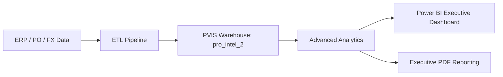
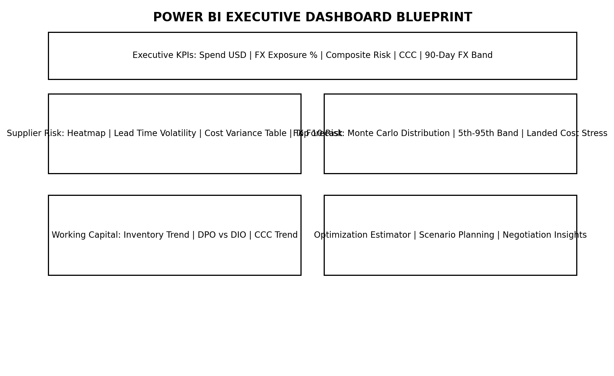
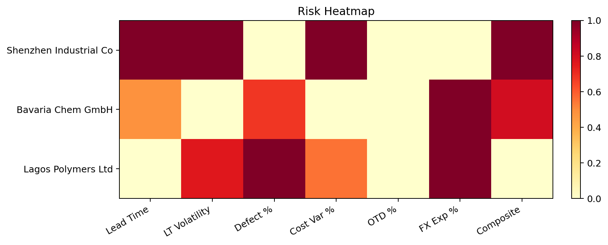
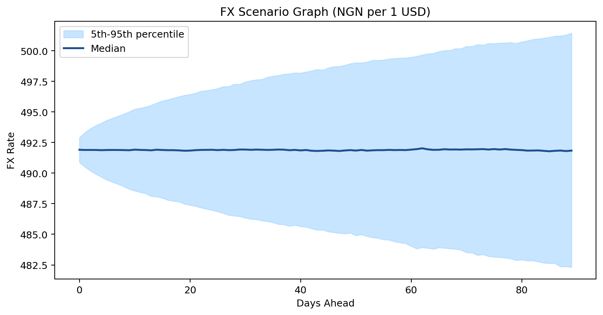
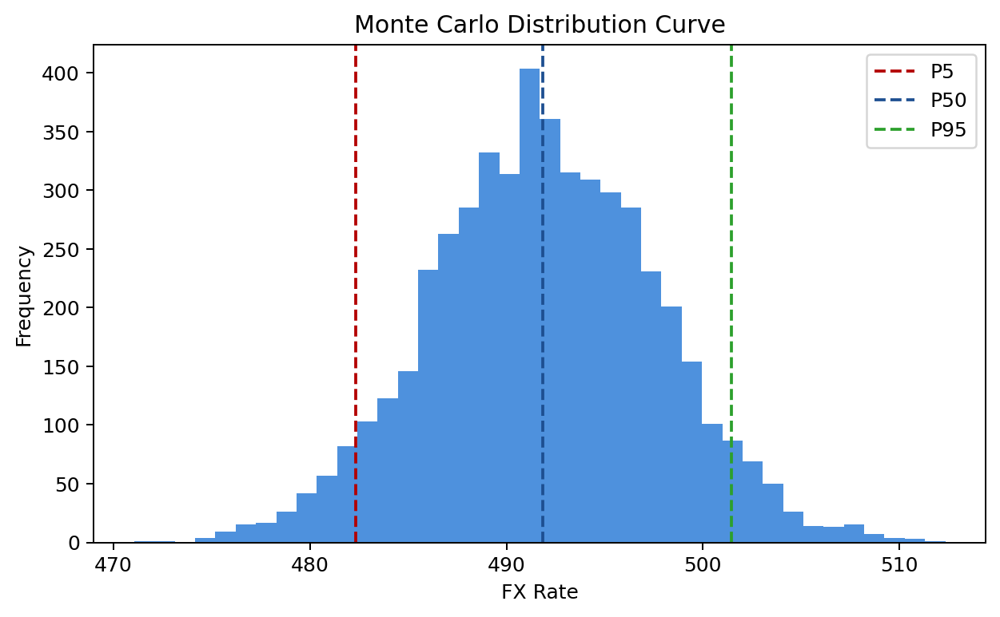
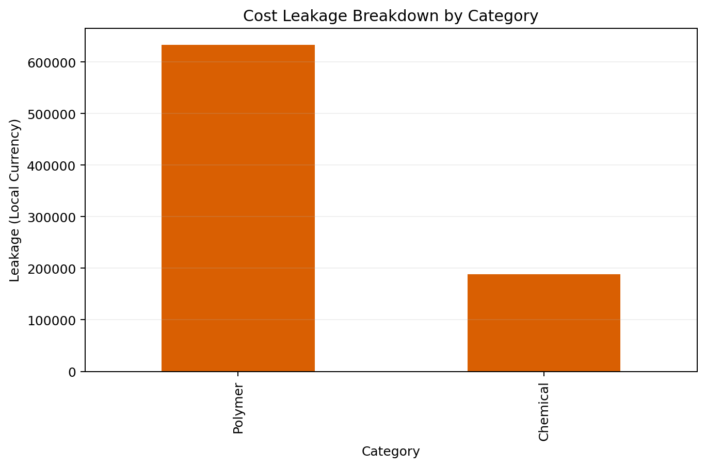

# Procurement Volatility Intelligence System (PVIS)

Board-grade intelligence for procurement volatility, FX exposure, and working capital performance.

## Business Problem

Procurement margins are being eroded by FX volatility, supplier performance variability, and working capital drag. The business lacks a unified view to quantify risk, run scenarios, and trigger negotiation actions across high-impact categories.

## PVIS Capabilities

- FX Exposure Mapping
- Supplier Risk Ranking
- Cash Conversion Cycle Analysis
- Monte Carlo FX Forecast
- Scenario Planning
- Working Capital Restructuring
- Negotiation Insights

## Architecture Diagram



## Data Model Explanation

PVIS uses a star schema with a procurement fact table and supplier/material/date dimensions.

- Fact: `fact_procurement` (grain: PO line item)
- Dimensions: `dim_date`, `dim_supplier`, `dim_material`
- Aggregates: `supplier_spend_summary`, `supplier_performance_metrics`, `financial_kpis`
- FX: `fx_rates`, `fx_simulation_results`

This structure supports scalable analytics, time-series slicing, and a clean semantic model for Power BI.

## Risk Score Formula

Composite Supplier Risk Index:

$$
\text{Risk} = 0.25\cdot \text{LeadTimeNorm} + 0.30\cdot \text{DefectNorm} + 0.25\cdot \text{OTDNorm} + 0.10\cdot \text{CostVarNorm} + 0.10\cdot \text{FXExposureNorm}
$$

Where each component is normalized to $[0,1]$ and the result is scaled to $[0,100]$.

## FX Monte Carlo Methodology

- Calculate daily log returns from historical FX rates
- Estimate drift ($\mu$) and volatility ($\sigma$)
- Simulate $N$ paths over 90 trading days using geometric Brownian motion
- Report P5, median (P50), and P95 for risk banding

## Dashboard Screenshots (Blueprints)



## Risk Heatmap



## FX Scenario Graphs




## Cost Leakage Breakdown



## Business Impact (Executive View)

- Visibility: enterprise-level FX exposure by supplier, category, and currency
- Risk Control: quantified supplier volatility to guide negotiations and re-sourcing
- Cash Efficiency: CCC visibility with levers for DPO/DIO optimization
- Scenario Readiness: 90-day FX risk banding for contingency planning

## Deliverables

- Executive PDF Report: reports/Executive_Report.pdf
- Risk Heatmap: reports/figures/risk_heatmap.png
- FX Scenario Graphs: reports/figures/fx_scenario_band.png, reports/figures/fx_distribution.png
- Cost Leakage Breakdown: reports/figures/cost_leakage_breakdown.png
- Dashboard Blueprint: reports/figures/dashboard_blueprint.png
- 3 Strategic Recommendations (embedded in report)

## Power BI Executive Dashboard Blueprint

Executive Overview KPIs:
- Total Procurement Spend (USD)
- FX Exposure %
- Composite Supplier Risk Index
- Cash Conversion Cycle
- 90-Day FX Risk Band

Supplier Risk Analysis Visuals:
- Risk Heatmap
- Lead Time Volatility Chart
- Cost Variance Table
- Top 10 Risk Suppliers

FX Volatility Forecast Visuals:
- Monte Carlo Distribution Curve
- 5th–95th percentile band
- Landed Cost Stress Impact

Working Capital Optimization Visuals:
- Inventory Trend
- DPO vs DIO
- CCC trend over time
- Optimization opportunity estimator

## Production Readiness Notes

- Secrets are sourced from environment variables (see config.py)
- Database constraints enforced via add_constraints_migration.sql
- Executive report and visuals generated from live data

## Quick Start

```powershell
cd "C:\Users\HP EliteBook\OneDrive\Documents\VSCode Projects\pro-intel-2-analytics"
..\..\.venv\Scripts\activate
pip install pymysql sqlalchemy pandas numpy matplotlib

python data_ingestion\generate_sample_data.py
python data_ingestion\populate_warehouse.py
python analytics\advanced_analytics.py

python reports\generate_pvis_visuals.py
python reports\generate_executive_report.py

python verify_setup.py
```

## Configuration (Environment Variables)

- PVIS_DATABASE_URL
- PVIS_DB_HOST
- PVIS_DB_PORT
- PVIS_DB_USER
- PVIS_DB_PASSWORD
- PVIS_DB_NAME

## Project Structure

```
pro-intel-2-analytics/
├── analytics/
│   └── advanced_analytics.py
├── data_ingestion/
│   ├── generate_sample_data.py
│   └── populate_warehouse.py
├── database/
│   └── add_constraints_migration.sql
├── reports/
│   ├── generate_executive_report.py
│   ├── generate_pvis_visuals.py
│   └── figures/
├── apply_constraints.py
├── config.py
├── PRODUCTION_READINESS.md
├── verify_setup.py
└── README.md
```

## Deployment Notes

- Ensure all 18 tables are present in `pro_intel_2` before first run.
- Run scripts in sequence: sample data → ETL → analytics → visuals → executive report.
- For enterprise production, complete hardening controls in `PRODUCTION_READINESS.md`.
